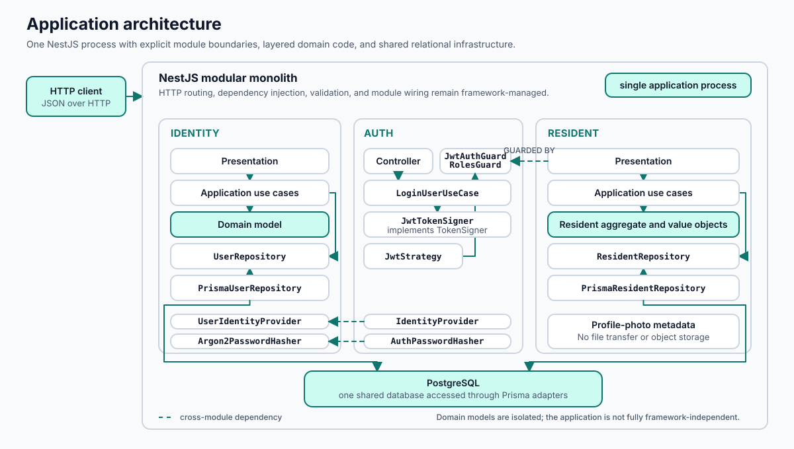
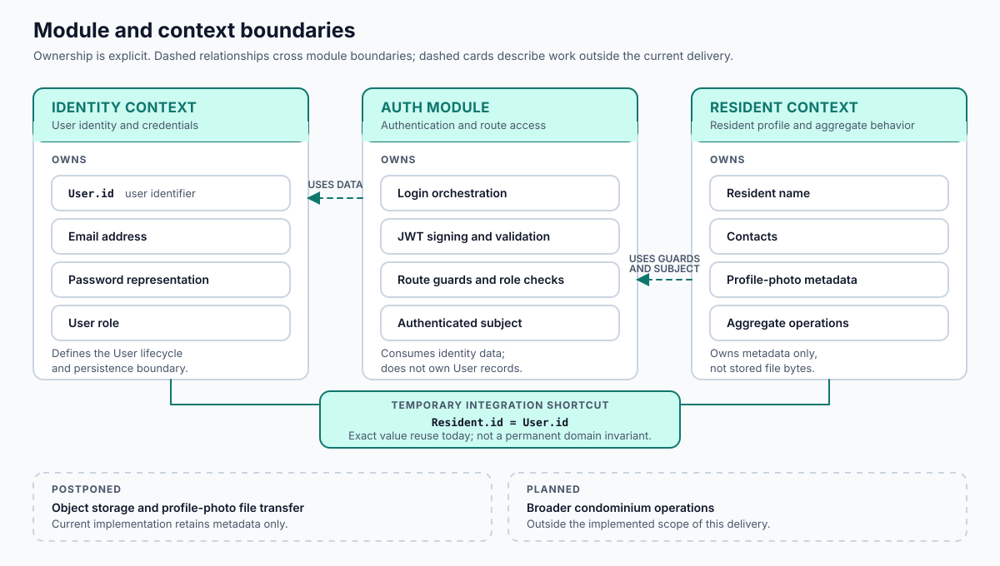
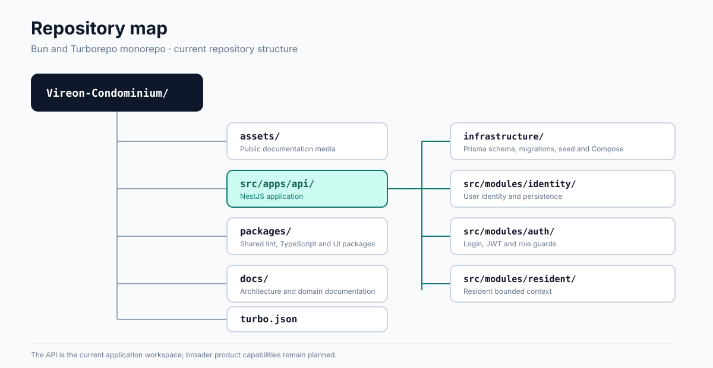

<p align="center">
  
</p>

<h1 align="center">Vireon Condominium</h1>

<p align="center">
  <strong>Domain-oriented con
  dominium management built as a NestJS modular monolith.</strong>
</p>

<p align="center">
  <a href="CHANGELOG.md"></a>
  <a href="docs/architecture/engineering-decisions.md#versioning-during-initial-development"></a>
  <a href="LICENSE"></a>
</p>

<p align="center">
  <a href="#project-status">Project status</a> ·
  <a href="#architecture">Architecture</a> ·
  <a href="#implemented-bounded-contexts-and-modules">Bounded contexts</a> ·
  <a href="#local-development">Run locally</a> ·
  <a href="#documentation">Documentation</a>
</p>

---

Vireon Condominium is an early-stage condominium management project. The current backend establishes identity, authentication, and resident-profile capabilities as a foundation for future condominium operations. The repository is intended to make domain rules and technical boundaries visible in code; it does not yet represent a complete condominium product.

> [!IMPORTANT]
> **Current delivery — `v0.2.0`**
>
> **Status:** pre-1.0 development delivery, prepared for publication
>
> This delivery documents and exposes the implemented Resident bounded context. Vireon remains below `1.0.0` because its public API, architecture, and domain model may still change incompatibly. See the [changelog](CHANGELOG.md) for the delivery scope and known limitations.

## Project status

| Area                             | Status                                            | Evidence in the current repository                                                                         |
| -------------------------------- | ------------------------------------------------- | ---------------------------------------------------------------------------------------------------------- |
| Identity                         | Implemented                                       | User creation, lookup, update, deletion, role assignment, email and password rules                         |
| Authentication                   | Implemented with known error-handling limitations | JWT login, bearer-token validation, and role guards                                                        |
| Resident                         | Implemented                                       | Resident profile, contacts, profile-photo metadata, use cases, HTTP routes, Prisma adapter, and unit tests |
| Profile-photo metadata           | Implemented                                       | Storage key, MIME type, and declared byte size are validated and persisted                                 |
| Object storage and file transfer | Postponed                                         | No runtime storage service, binary upload, object verification, signed read, or cleanup flow is present    |
| Authorization                    | Partially implemented                             | Routes use JWT and role guards; resident ownership is not checked on contact mutation routes               |
| Verification                     | Partially implemented                             | Unit tests exist across Resident layers; no active integration or end-to-end test suite is present         |
| Broader condominium operations   | Planned                                           | Condominium, unit, membership, communication, occurrence, and related workflows are not implemented        |

## Business context

Condominium operations require more than user accounts. The product direction is to connect authenticated identities with resident profiles and, in later deliveries, the operational records of a condominium. Version `v0.2.0` is limited to the identity-to-resident foundation: it does not yet model buildings, units, occupancy, notices, requests, or occurrences.

---

## Architecture

The API is a NestJS modular monolith. `Identity` and `Resident` are separate domain boundaries, while `Auth` provides login, token, and role-guard behavior.

[](docs/architecture/overview.md)

Within Resident:

- Presentation controllers translate HTTP input into application commands.
- Application use cases coordinate the aggregate through the `ResidentRepository` port.
- The domain owns resident, contact, name, phone, email, and profile-photo rules without importing NestJS or Prisma.
- Infrastructure provides the Prisma repository, persistence mapper, and in-memory test adapter.
- `ResidentModule` binds the repository port to the Prisma adapter at runtime.

> [!NOTE]
> This is a concrete ports-and-adapters arrangement, with two current qualifications: application classes use NestJS dependency-injection decorators, and Resident presentation imports guards from the Auth module.

Read the [architecture overview](docs/architecture/overview.md) and [engineering decisions](docs/architecture/engineering-decisions.md) for the dependency flow and trade-offs.

## Implemented bounded contexts and modules



### Identity

- **Owns:** User identifier, email, password representation, and role.
- **Does not own:** Resident profile and condominium relationships.

### Auth

- **Owns:** Login orchestration, JWT creation and validation, and route role checks.
- **Does not own:** User persistence and resident business rules.

### Resident

- **Owns:** Resident name, contacts, profile-photo metadata, and aggregate operations.
- **Does not own:** Credentials, token issuance, binary file storage, and condominium-unit relationships.

The current Resident implementation supports:

- creating and renaming the resident associated with the authenticated user;
- administrative lookup, listing, photo-metadata replacement, and deletion;
- public case-insensitive lookup by name;
- adding, editing, prioritizing, and removing email or Brazilian mobile-phone contacts;
- enforcing the creation/addition limit of ten contacts;
- validating person names, UUIDs, contact values, PNG/JPEG content types, and a 5 MiB photo-metadata size ceiling;
- persistence through Prisma and PostgreSQL.

For the complete model, API table, authorization behavior, error model, and limitations, read the [Resident bounded-context documentation](docs/contexts/bounded-contexts/resident.md).

## Technology stack

- Bun `1.3.14` and Turborepo `2.10`
- TypeScript `5.9`
- NestJS `11`
- Prisma `7` with PostgreSQL `17`
- Passport JWT and `@nestjs/jwt`
- Argon2 password hashing
- Jest `30`, ESLint `9`, and Prettier `3`
- Docker Compose for the local PostgreSQL service

## Repository structure



<details>
<summary><strong>Text representation</strong></summary>

```text
Vireon-Condominium/
├── assets/                         Project media referenced by the public documentation
├── src/apps/api/                    NestJS API
│   ├── infrastructure/              Prisma schema, migrations, seed source, Compose
│   └── src/modules/
│       ├── identity/                User identity and persistence
│       ├── auth/                    Login, JWT, and role guards
│       └── resident/                Resident bounded context
├── packages/                        Shared lint, TypeScript, and UI packages
├── docs/                            Public architecture and domain documentation
└── turbo.json                       Monorepo task graph
```

</details>

---

## Local development

### Prerequisites

- Bun `1.3.14`
- Docker with Docker Compose V2

### 1. Install dependencies

From the repository root:

```bash
bun install
```

### 2. Configure the API

```bash
cp src/apps/api/.env.example src/apps/api/.env
```

> [!CAUTION]
> The example file defines the required database and JWT settings. Do not commit the resulting `.env` file.

| Variable            | Required | Purpose                                        |
| ------------------- | -------- | ---------------------------------------------- |
| `DATABASE_URL`      | Yes      | Prisma/PostgreSQL connection string            |
| `POSTGRES_USER`     | Yes      | Local Compose database user                    |
| `POSTGRES_PASSWORD` | Yes      | Local Compose database password                |
| `POSTGRES_DB`       | Yes      | Local Compose database name                    |
| `DB_PORT`           | Yes      | Host port mapped to PostgreSQL                 |
| `JWT_SECRET`        | Yes      | JWT signing and verification secret            |
| `JWT_EXPIRES_IN`    | No       | Token lifetime; defaults to `15m`              |
| `PORT`              | No       | API port; defaults to `3000`                   |
| `NODE_ENV`          | No       | Runtime environment; defaults to `development` |

### 3. Start PostgreSQL

```bash
bun run db:up
```

### 4. Generate Prisma Client and apply development migrations

Run the Prisma commands from the API workspace so that `prisma.config.ts` is discovered:

```bash
cd src/apps/api
bunx prisma generate
bunx prisma migrate dev
```

Then return to the repository root and start the monorepo development task:

```bash
cd ../../..
bun run dev
```

The API listens on `http://localhost:3000` unless `PORT` is changed.

> [!NOTE]
> The seed source is present, but no root or API package script currently wires it into the documented setup. Review it before executing it in a local environment.

## Commands

Run these from the repository root unless noted otherwise.

| Command                                   | Effect                                                 |
| ----------------------------------------- | ------------------------------------------------------ |
| `bun run dev`                             | Start workspace development tasks                      |
| `bun run build`                           | Build workspaces that define a build task              |
| `bun run test`                            | Run Jest through Turborepo                             |
| `bun run check-types`                     | Run workspace TypeScript checks                        |
| `bun run lint`                            | Run workspace ESLint tasks; the API task uses `--fix`  |
| `bun run format`                          | Rewrite supported files with Prettier                  |
| `bun run format:check`                    | Check formatting without rewriting files               |
| `bun run eval`                            | Format, lint, type-check, recheck formatting, and test |
| `bun run db:up`                           | Start the local PostgreSQL service                     |
| `bun run db:stop`                         | Stop the local PostgreSQL service                      |
| `bun run infra:up` / `bun run infra:down` | Start or remove all currently defined Compose services |

> [!NOTE]
> The GitHub Actions workflow is configured to install dependencies, generate Prisma Client, check formatting, lint, type-check, apply migrations to a PostgreSQL service, run tests, and build. A configured workflow is not evidence that an arbitrary branch is currently passing; consult the corresponding GitHub run when that status matters.

## Testing

Resident has co-located Jest unit specifications for domain objects, application use cases, the in-memory repository, persistence mapping, DTO validation, response mapping, and controller delegation. Use-case tests use `FakeResidentRepository`; they do not connect to PostgreSQL. There are no active integration or end-to-end specifications in the current tree.

Run all workspace tests:

```bash
bun run test
```

> [!NOTE]
> Some WSL shells inherit a Windows temporary-directory path that Jest cannot create. If the root Turborepo command reports `jest_rs` with `ENOENT`, run Jest directly from the API workspace with a Linux temporary directory:
>
> ```bash
> cd src/apps/api
> TMPDIR=/tmp bun run test
> ```

Run only Resident specifications from `src/apps/api`:

```bash
TMPDIR=/tmp bun run test -- --runInBand --testPathPatterns=modules/resident
```

---

## Current limitations

- Public API contracts are not versioned and may change before `1.0.0`.
- `Resident.id` currently reuses `User.id`; this is a temporary integration simplification, not a permanent domain invariant.
- Contact routes allow the `USER` role to supply any resident identifier; ownership enforcement is not implemented there.
- Profile-photo operations accept and persist metadata only. No multipart upload, object-storage adapter, file lifecycle, or retrievable URL is implemented.
- The Prisma relation permits a missing profile-photo row, while the Resident domain and repository expect one.
- Resident typed exceptions are not recognized by the currently registered Identity exception filter and therefore reach the generic HTTP 500 branch.
- No OpenAPI specification, integration test suite, active end-to-end suite, or production deployment configuration is present.

## Documentation

| Architecture and domain                                                | Project and API                                                        |
| ---------------------------------------------------------------------- | ---------------------------------------------------------------------- |
| [Documentation index](docs/README.md)                                  | [API setup and route summary](src/apps/api/README.md)                  |
| [Architecture overview](docs/architecture/overview.md)                 | [Changelog](CHANGELOG.md)                                              |
| [Engineering decisions](docs/architecture/engineering-decisions.md)    | [Identity bounded context](docs/contexts/bounded-contexts/identity.md) |
| [Resident bounded context](docs/contexts/bounded-contexts/resident.md) |                                                                        |

## Roadmap

`v0.2.0` is the current Resident delivery. The next work is intentionally unversioned until a delivery is approved. Candidate areas include independent Resident identity, ownership-aware authorization, operational profile-photo storage, integration/E2E testing, and the condominium/unit/membership model. These items are planned, not implemented.

## License

This project is licensed under the [MIT License](LICENSE).
