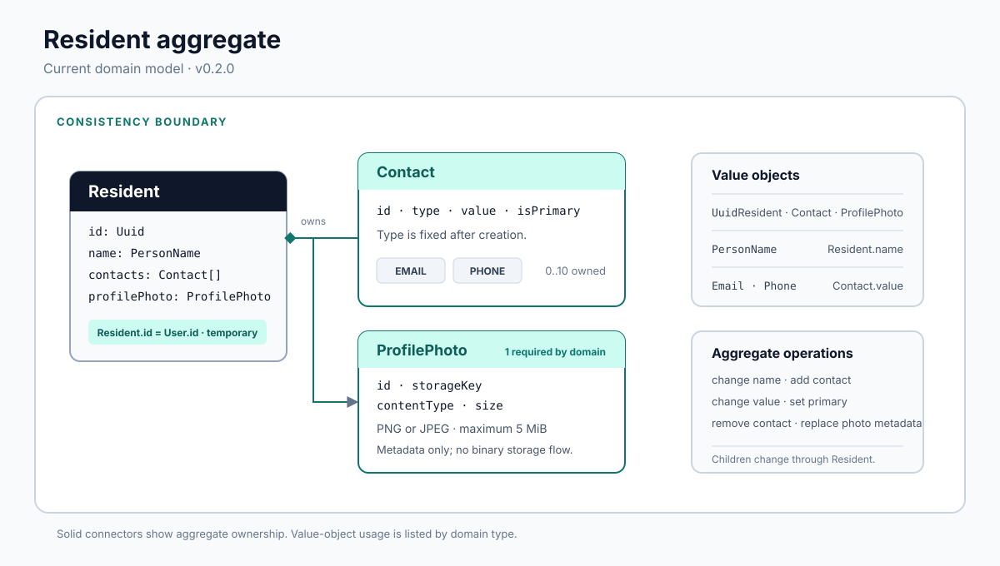

# Resident Bounded Context

## Purpose

The Resident bounded context manages the condominium-facing profile associated with a system identity. It owns a resident's name, contact channels, primary-contact selection, and profile-photo metadata.

This document describes the implementation delivered in `v0.2.0`. Vireon remains under active development, and the public API and domain model may still change incompatibly before `1.0.0`.

## Scope

Implemented scope:

- Create a resident profile for the authenticated user.
- Change the authenticated resident's name.
- Find residents by identifier or a case-insensitive name fragment.
- List and delete residents through administrator-only routes.
- Add, edit, select, and remove resident contacts.
- Replace profile-photo metadata.
- Persist resident aggregates with Prisma and PostgreSQL.

The context does not own authentication credentials, JWT issuance, user roles, apartment membership, file upload, object storage, or notification delivery.

## Responsibilities

- Protect the rules of the `Resident` aggregate.
- Validate resident names, contact values, UUIDs, and new profile-photo metadata.
- Coordinate resident commands and queries through application use cases.
- Expose the current HTTP API through NestJS.
- Persist and restore the aggregate through the `ResidentRepository` port.

## Boundaries

`Identity` owns `User` and its lifecycle. `Auth` authenticates requests and supplies the subject identifier and role. Resident does not import or manipulate the Identity `User` entity; the presentation layer passes the authenticated identifier into Resident commands.

The current relational adapter nevertheless has a direct database relationship to `User`: `Resident.id` is also a foreign key to `User.id`. This shared-key mapping is a temporary implementation decision, documented under [Engineering Decisions](#engineering-decisions).

Profile photos are metadata within Resident. No implemented storage adapter uploads, reads, signs, or deletes image objects. Apartment and notification concerns are outside the current implementation.

## Ubiquitous Language

| Term            | Meaning in the current implementation                                                                            |
| --------------- | ---------------------------------------------------------------------------------------------------------------- |
| Resident        | Aggregate root containing a condominium-facing profile.                                                          |
| Contact         | An owned communication channel with a type, value, and primary flag.                                             |
| Primary contact | The contact selected by `Resident.setPrimaryContact`; selection clears the flag from the other current contacts. |
| Profile photo   | Metadata describing an image object: identifier, storage key, MIME type, and byte size.                          |
| User identifier | UUID supplied by Auth/Identity and currently reused as the resident identifier.                                  |
| Restore         | Reconstruct a domain object from persistence data without applying every new-object validation again.            |

## Aggregate Root

[`Resident`](../domain-models/resident/resident.md) is the aggregate root. Application use cases load one Resident, invoke an aggregate operation, and persist the resulting aggregate. Contacts and profile-photo metadata are not changed through independent repositories.

The aggregate owns:

- One normalized [`PersonName`](../domain-models/resident/person-name.md).
- Up to ten [`Contact`](../domain-models/resident/contact.md) entities.
- One [`ProfilePhoto`](../domain-models/resident/profile-photo.md) in the current domain model.



## Entities

| Entity         | Identity                                         | Ownership             | Mutable behavior                                                          |
| -------------- | ------------------------------------------------ | --------------------- | ------------------------------------------------------------------------- |
| `Resident`     | `Uuid`; currently the associated `User.id` value | Aggregate root        | Name, profile-photo reference, and contact collection                     |
| `Contact`      | Generated `Uuid`                                 | Owned by one Resident | Value and primary status; type is fixed                                   |
| `ProfilePhoto` | Generated `Uuid`                                 | Owned by one Resident | Immutable metadata object; the Resident replaces it with another instance |

## Value Objects

| Value object                                             | Responsibility                                                             |
| -------------------------------------------------------- | -------------------------------------------------------------------------- |
| [`Uuid`](../domain-models/resident/uuid.md)              | Generate or validate UUID strings and compare them by value.               |
| [`PersonName`](../domain-models/resident/person-name.md) | Normalize and validate resident names.                                     |
| [`Email`](../domain-models/resident/email.md)            | Normalize and validate email contact values.                               |
| [`Phone`](../domain-models/resident/phone.md)            | Validate Brazilian mobile numbers in the implemented international format. |

There are no dedicated `ResidentId` or `UserId` classes in the current source. Both concepts use `Uuid`, and the Resident aggregate stores one identifier.

## Domain Invariants

The current implementation enforces the following rules on new objects and aggregate operations:

- A resident identifier must be a valid UUID.
- A resident name is required, is limited to 255 characters, and may contain Unicode letters, apostrophes, spaces, and hyphens.
- A Resident can contain no more than ten contacts when created or when a contact is added.
- A contact type is fixed as `EMAIL` or `PHONE` once the Contact is created.
- Email contacts use the Resident email validator; phone contacts use the Brazilian mobile-number validator.
- Selecting a primary contact clears the primary flag from every other contact currently in the aggregate.
- Changing or removing a missing contact raises `ContactNotFoundException`.
- New profile-photo metadata accepts only `image/png` and `image/jpeg`, requires a non-empty storage key, and allows at most 5 MiB.
- Resident creation supplies the default photo metadata `defaults/profile.jpg`, `image/jpeg`, and `124000` bytes.

Restoration paths intentionally trust more persistence data than creation paths. In particular, `Resident.restore` does not repeat the ten-contact check, and `Contact.restore` and `ProfilePhoto.restore` do not repeat their value/metadata validation. They do validate restored UUIDs, while Resident restoration also rebuilds the name through `PersonName.create`.

## Commands

| Command                     | Input                                        | Effect                                                                            |
| --------------------------- | -------------------------------------------- | --------------------------------------------------------------------------------- |
| `CreateResidentCommand`     | Authenticated user ID, name                  | Creates a Resident with the shared identifier and default profile-photo metadata. |
| `UpdateResidentCommand`     | Resident ID, name                            | Replaces the normalized name.                                                     |
| `DeleteResidentCommand`     | Resident ID                                  | Deletes the persisted Resident.                                                   |
| `AddContactCommand`         | Resident ID, type, value                     | Creates and adds a non-primary Contact.                                           |
| `UpdateContactValueCommand` | Resident ID, contact ID, value               | Validates and changes a Contact value without changing its type.                  |
| `SetPrimaryContactCommand`  | Resident ID, contact ID                      | Makes the selected Contact primary and clears the other flags.                    |
| `RemoveContactCommand`      | Resident ID, contact ID                      | Removes a Contact from the aggregate.                                             |
| `UpdateProfilePhotoCommand` | Resident ID, storage key, content type, size | Creates new metadata and asks the aggregate to replace its profile photo.         |

## Queries

| Query use case           | Behavior                                                                                                |
| ------------------------ | ------------------------------------------------------------------------------------------------------- |
| `GetResidentByIdUseCase` | Returns one Resident or raises `ResidentNotFoundException`.                                             |
| `GetByNameUseCase`       | Performs a case-insensitive substring search and raises `ResidentNotFoundException` when no rows match. |
| `GetAllResidentsUseCase` | Returns all persisted residents, including an empty list.                                               |

There is no separate “find by user ID” query. In `v0.2.0`, the user and resident identifiers have the same value, so the repository has only `getById`.

## Application Use Cases

The application layer contains one class for each command or query listed above. It depends on the `ResidentRepository` port rather than Prisma. Mutation use cases generally load the aggregate, raise `ResidentNotFoundException` when it is absent, invoke a domain method, and call `update`.

Notable exceptions to that pattern are:

- `CreateResidentUseCase` checks for an existing row before `save`.
- `DeleteResidentUseCase` delegates directly to `delete` and does not translate a missing row into `ResidentNotFoundException`.
- `GetAllResidentsUseCase` delegates directly to `getAll`.

## Public API

The implemented controller exposes exactly eleven routes under `/residents`. “User or admin” means that both roles pass the current role guard; it does not imply resource ownership.

| Method   | Route                                        | Purpose                                  | Authentication | Authorization | Input                                                | Success response               | Relevant logical errors                                       |
| -------- | -------------------------------------------- | ---------------------------------------- | -------------- | ------------- | ---------------------------------------------------- | ------------------------------ | ------------------------------------------------------------- |
| `POST`   | `/residents`                                 | Create the authenticated user's Resident | JWT            | User or admin | Body: `{ "name": string }`                           | `201`; no response body        | Resident already exists; invalid UUID or name                 |
| `PATCH`  | `/residents`                                 | Change the authenticated resident's name | JWT            | User or admin | Body: `{ "name": string }`                           | `200`; no response body        | Resident not found; invalid name                              |
| `DELETE` | `/residents/:id`                             | Delete a Resident                        | JWT            | Admin         | Path: `id`                                           | `200`; no response body        | Prisma delete failure, including a missing row                |
| `GET`    | `/residents?name=:name`                      | Search by name fragment                  | None           | Public        | Query: `name`                                        | `200`; Resident response array | Resident not found when the result is empty                   |
| `GET`    | `/residents/all`                             | List every Resident                      | JWT            | Admin         | None                                                 | `200`; Resident response array | Persistence/restoration failure                               |
| `GET`    | `/residents/:id`                             | Find a Resident by ID                    | JWT            | Admin         | Path: `id`                                           | `200`; Resident response       | Resident not found                                            |
| `PATCH`  | `/residents/:id/photo`                       | Replace profile-photo metadata           | JWT            | Admin         | Body: `storageKey`, `contentType`, `size`            | `200`; Resident response       | Resident not found; invalid image type, size, or storage key  |
| `POST`   | `/residents/:id/contacts`                    | Add a Contact                            | JWT            | User or admin | Body: `{ "type": string, "value": string }`          | `201`; Resident response       | Resident not found; invalid contact; maximum contacts reached |
| `PATCH`  | `/residents/:id/contacts/:contactId`         | Change a Contact value                   | JWT            | User or admin | Path: `id`, `contactId`; body: `{ "value": string }` | `200`; Resident response       | Resident or Contact not found; invalid contact value          |
| `PATCH`  | `/residents/:id/contacts/:contactId/primary` | Select the primary Contact               | JWT            | User or admin | Path: `id`, `contactId`                              | `200`; Resident response       | Resident or Contact not found                                 |
| `DELETE` | `/residents/:id/contacts/:contactId`         | Remove a Contact                         | JWT            | User or admin | Path: `id`, `contactId`                              | `200`; Resident response       | Resident or Contact not found                                 |

The Resident response shape is:

```json
{
  "id": "550e8400-e29b-41d4-a716-446655440000",
  "name": "Joao Silva",
  "profilePhoto": "defaults/profile.jpg",
  "contacts": [
    {
      "id": "660e8400-e29b-41d4-a716-446655440000",
      "type": "EMAIL",
      "value": "joao@example.com",
      "isPrimary": true
    }
  ]
}
```

`profilePhoto` is the stored key, not a URL or embedded object. The photo route accepts metadata as JSON; it does not accept a multipart file upload.

## Persistence

`PrismaResidentRepository` is the runtime adapter wired to the `ResidentRepository` token. `FakeResidentRepository` is the in-memory adapter used by unit tests.

| Prisma model   | Relevant fields and relationships                                                                                                      |
| -------------- | -------------------------------------------------------------------------------------------------------------------------------------- |
| `Resident`     | `id` is the primary key and foreign key to `User.id`; `name` is required; owns many contacts and an optional relational profile photo. |
| `Contact`      | Has its own `id`, required `residentId`, enum `type`, value, and `isPrimary`; deleting the Resident cascades to contacts.              |
| `ProfilePhoto` | Has its own `id`, unique `residentId`, storage key, Prisma `ImageType`, and size; deleting the Resident cascades to the photo row.     |

The mapper converts domain MIME values (`image/png`, `image/jpeg`) to Prisma enum values (`PNG`, `JPEG`). On aggregate update it deletes all Contact rows and recreates the current contact list. It upserts profile-photo metadata.

There is an important model mismatch: Prisma declares `Resident.profilePhoto` optional, but the domain constructor requires a ProfilePhoto and the repository throws a generic error when it loads a Resident without one. The database permits a state that the adapter cannot restore.

The latest migration constrains deletion of a referenced User, while deleting a Resident cascades to its Contact and ProfilePhoto rows.

## Error Model

Resident defines typed exceptions with explicit current codes for not-found and duplicate residents, invalid UUIDs and names, invalid email and phone values, missing contacts, the ten-contact limit, and invalid profile-photo metadata.

The intended domain/application codes include:

| Area                | Codes                                                                                         |
| ------------------- | --------------------------------------------------------------------------------------------- |
| Resident            | `RESIDENT_ALREADY_EXISTS`, `RESIDENT_NOT_FOUND`, `RESIDENT_MAX_CONTACTS`, `CONTACT_NOT_FOUND` |
| Name and identifier | `NAME_IS_REQUIRED`, `INVALID_NAME`, `NAME_TOO_LARGE`, `INVALID_UUID`                          |
| Contact values      | `EMAIL_IS_REQUIRED`, `INVALID_EMAIL_FORMAT`, `PHONE_IS_REQUIRED`, `INVALID_PHONE`             |
| Profile photo       | `STORAGE_KEY_IS_REQUIRED`, `INVALID_IMAGE_TYPE`, `IMAGE_EXCEEDS_MAX_SIZE`                     |

Current HTTP mapping is incomplete. The global filter checks the Identity context's `DomainException` class, while Resident exceptions extend a separate Resident `DomainException`. As a result, Resident typed exceptions currently fall through to the generic `500 Internal server error` response instead of the filter's domain-error branch, which returns `400` with a code. Prisma errors also fall through to `500`.

Nest validation and guard failures are `HttpException` instances and retain their framework status, including request-validation `400`, unauthenticated `401`, and forbidden `403` responses.

## Authorization Behavior

- `POST /residents` and `PATCH /residents` derive the target identifier from the authenticated JWT subject. A request body cannot select another Resident for these operations.
- Delete, list-all, get-by-ID, and profile-photo replacement are administrator-only.
- Name search is public and returns the full Resident response shape.
- Contact mutation routes allow both users and administrators and accept the target Resident ID from the path.
- The contact routes do not compare the path identifier with the authenticated subject. A user who knows another Resident ID can currently attempt to mutate that Resident's contacts. Role checks therefore exist, but ownership authorization is incomplete.

## Dependencies

The primary dependency direction is:

```text
NestJS controller -> application use case -> Resident domain
                              |
                              v
                    ResidentRepository port
                              ^
                              |
                 PrismaResidentRepository -> Prisma -> PostgreSQL
```

The presentation layer imports JWT and role guards from Auth. The domain layer does not depend on NestJS, Prisma, Auth, or the Identity `User` entity. Infrastructure depends inward on the application repository port and the domain objects it maps.

There is no implemented object-storage dependency. `storageKey` is persisted as an opaque string.

## Testing Strategy

The repository contains Resident-focused unit tests at four boundaries:

- Domain tests for Resident, Contact, ProfilePhoto, Uuid, PersonName, Email, and Phone rules.
- Application tests for all command and query use cases using `FakeResidentRepository`.
- Infrastructure unit tests for `ResidentMapper` and the fake repository.
- Presentation unit tests for the controller, request DTO validation, and response DTO construction. Controller tests exercise response mapping indirectly; there is no dedicated `ResidentResponseMapper` specification.

No Resident integration test exercises `PrismaResidentRepository` against PostgreSQL, and no Resident E2E specification exercises the HTTP routes with real guards, filters, and persistence. Existing controller tests call controller methods directly and do not prove the effective HTTP status or exception mapping.

## Engineering Decisions

### Temporary Shared Identifier

The complete context, decision, benefit, consequence, limitation, and planned evolution are recorded in [Temporary shared User and Resident identifier](../../architecture/engineering-decisions.md#temporary-shared-user-and-resident-identifier). In short, `v0.2.0` reuses the associated `User.id` as `Resident.id` to reduce current one-to-one integration complexity. This couples their identities and lifecycles and prevents full independence; an identity owned by Resident plus a separate `userId` association is planned, not implemented.

### Repository port with interchangeable adapters

Application use cases depend on `ResidentRepository`. The NestJS module binds that port to `PrismaResidentRepository`, while unit tests use `FakeResidentRepository`. This keeps Prisma out of the domain and application logic, but the fake does not reproduce database constraints or relational failure modes.

### Separate creation and restoration paths

Resident entities distinguish creation, which generates child identifiers and applies new-object validation, from restoration, which rebuilds persisted state. Restoration deliberately avoids several validations, so the persistence adapter is trusted to supply valid historical data.

## Current Limitations

- Resident and User identities and lifecycles are coupled by the shared primary key.
- Resident exceptions are not mapped to appropriate HTTP statuses and currently produce generic `500` responses.
- User-role checks exist, but contact mutations do not enforce ownership.
- Resident name search is unauthenticated and returns the complete response shape.
- Resident name search has no query DTO or required-field validation; the behavior of an omitted `name` value is not defined consistently at the presentation boundary.
- The contact request DTO validates `type` only as a string, not as the `EMAIL`/`PHONE` enum; an unsupported string can bypass contact-value validation and fail later at persistence.
- Profile-photo updates accept metadata only. There is no file upload, object existence check, signed read URL, replacement cleanup, or deletion cleanup.
- The default `defaults/profile.jpg` key is created as metadata, but the implementation does not provision an object at that key.
- The domain requires a profile photo, while the Prisma relation is nullable.
- Profile-photo size has an upper bound but no non-negative or integer domain rule.
- Aggregate updates replace all persisted Contact rows rather than applying incremental relational changes.
- Restoration paths can reintroduce states that creation paths would reject.
- There is no real-database integration coverage or Resident HTTP E2E coverage.

## Planned Evolution

The confirmed identity evolution is to introduce an independent Resident identifier and retain the User association through an explicit `userId` field.

Other implementation gaps that should be resolved before documenting the related capabilities as complete include:

- Add resource-ownership authorization for resident-scoped mutations.
- Map Resident and persistence failures to an explicit HTTP error contract.
- Align profile-photo nullability across the domain, mapper, and schema.
- Add a real object-storage workflow if profile-photo upload and retrieval are delivered.
- Validate contact type and photo size at the request boundary and in the domain.
- Add Prisma integration tests and guarded HTTP E2E tests.

These items are planned evolution, not implemented behavior in `v0.2.0`.

## Implementation Evidence

- [Resident controller](../../../src/apps/api/src/modules/resident/presentation/nestjs/controllers/resident.controller.ts) and [controller tests](../../../src/apps/api/src/modules/resident/presentation/nestjs/controllers/resident.controller.spec.ts)
- [Resident module wiring](../../../src/apps/api/src/modules/resident/presentation/nestjs/resident.module.ts)
- [Application commands and use cases](../../../src/apps/api/src/modules/resident/application)
- [Resident aggregate](../../../src/apps/api/src/modules/resident/domain/entities/Resident.ts) and [aggregate tests](../../../src/apps/api/src/modules/resident/domain/entities/Resident.spec.ts)
- [Repository port](../../../src/apps/api/src/modules/resident/application/ports/ResidentRepository.ts), [Prisma adapter](../../../src/apps/api/src/modules/resident/infrastructure/repositories/PrismaResidentRepository.ts), and [persistence mapper](../../../src/apps/api/src/modules/resident/infrastructure/mappers/ResidentMapper.ts)
- [Prisma schema](../../../src/apps/api/infrastructure/database/prisma/schema.prisma) and [Resident migrations](../../../src/apps/api/infrastructure/database/prisma/migrations)
- [Engineering decisions](../../architecture/engineering-decisions.md), [`v0.2.0` changelog](../../../CHANGELOG.md), and [documentation index](../../README.md)
